# Book-to-Course: Visual Diagrams

These diagrams can be rendered in GitHub, GitLab, or any Mermaid-compatible viewer.

---

## 1. High-Level System Architecture


---

## 2. Complete User Flow


---

## 3. Video Generation Pipeline (Detailed)


---

## 4. Remotion Frame Rendering


---

## 5. Data Flow Diagram

```mermaid
flowchart TD
    subgraph User
        PDF[PDF Book]
    end
    
    subgraph Storage["Data Storage (backend/data/books/{book_id})"]
        BookPDF[book.pdf]
        BookTXT[book.txt]
        ImagesDir[images/]
        ImagesMeta[_images.json]
        OutlineJSON[outline.json]
        ScriptTXT[lesson_X_script.txt]
        QuizJSON[lesson_X_quiz.json]
        PropsJSON[lesson_X_props.json]
        VideoMP4[lesson_X.mp4]
    end
    
    subgraph RemotionPublic["video/public/generated/{book_id}"]
        GenAudio[lesson_audio.mp3]
        GenImages[images/]
    end
    
    PDF -->|Upload| BookPDF
    BookPDF -->|Extract Text| BookTXT
    BookPDF -->|Extract Images| ImagesDir
    ImagesDir -->|Vision Analysis| ImagesMeta
    
    BookTXT -->|LLM| OutlineJSON
    OutlineJSON -->|LLM| ScriptTXT
    ScriptTXT -->|LLM| QuizJSON
    
    ScriptTXT -->|Video Gen| PropsJSON
    ImagesMeta -->|Match| PropsJSON
    
    PropsJSON -->|Remotion| VideoMP4
    ImagesDir -->|Copy| GenImages
    ScriptTXT -->|TTS| GenAudio
```



---

## 6. Component Architecture (Frontend)


---

## 7. LLM Agent Pipeline (Conceptual)

```mermaid
flowchart LR
    subgraph Agents["AI Agents"]
        A1[📚 Outline Agent<br/>Curriculum Designer]
        A2[📝 Lesson Planner<br/>Learning Objectives]
        A3[✍️ Lesson Writer<br/>Script & Content]
        A4[❓ Assessment Agent<br/>Quiz Generator]
        A5[👁️ Vision Agent<br/>Image Analyzer]
        A6[🎬 Video Agent<br/>Orchestrator]
    end
    
    subgraph Flow
        Book[Book PDF] --> A1
        A1 -->|Outline| A2
        A2 -->|Plan| A3
        A3 -->|Script| A4
        A4 -->|Quiz| A6
        Book --> A5
        A5 -->|Image Descriptions| A6
        A3 -->|Script| A6
        A6 -->|Video| Output[MP4]
    end
```



---

## How to View These Diagrams

1. **GitHub/GitLab**: Diagrams render automatically in Markdown preview
2. **VS Code**: Install "Markdown Preview Mermaid Support" extension
3. **Online**: Paste into [mermaid.live](https://mermaid.live)
4. **Export**: Use mermaid-cli to export as PNG/SVG:
   ```bash
   npm install -g @mermaid-js/mermaid-cli
   mmdc -i DIAGRAMS.md -o diagrams.png
   ```

---

*Generated for Book-to-Course project documentation*

